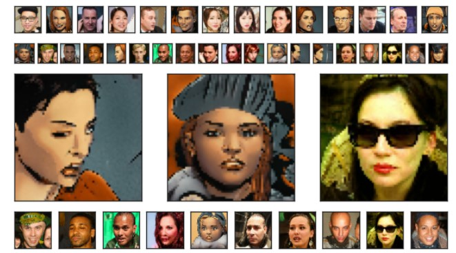

# Deep-Learning-Based System for Image Classification

This repository contains the code and resources for a deep-learning-based system designed to classify images from the Comics Faces dataset into real and comic faces. The project involves data preprocessing, baseline model creation, hyperparameter tuning, and the development of advanced neural networks, including Multi-Layer Perceptron (MLP) and Convolutional Neural Networks (CNNs).



## Project Structure

- **`MATTEO_CIARROCCHI_PROGETTO_AMD.ipynb`**: Main Jupyter notebook containing the code and implementation details.
- **`REPORT_AMD_PROJECT.pdf`**: A detailed report summarizing the theoretical background, methodologies, and results of the project.

## Dataset

The dataset consists of 20,000 images evenly split into real and comic face classes. Images were preprocessed as follows:
- Resized to dimensions (64, 64) to reduce computational complexity.
- Normalized to the range [0, 1].
- Stored in TFRecord format for efficient processing with Tensor Processing Units (TPUs).

## Key Features

1. **Baseline Model**:
   - A single dense layer with sigmoid activation.
   - Optimized with stochastic gradient descent and binary cross-entropy loss.

2. **Hyperparameter Tuning**:
   - Explored various batch sizes to optimize model performance.
   - Trained for a maximum of 20 epochs.

3. **Multi-Layer Perceptron (MLP)**:
   - Added two hidden layers with 200 and 60 nodes, using ReLU activation.
   - Enhanced optimization with the Adam optimizer.

4. **Regularization**:
   - Dropout technique applied with a rate of 0.25, though it did not improve performance significantly.

5. **Convolutional Neural Network (CNN)**:
   - Used convolutional layers with kernel sizes 3 and 6, filters 12 and 24, and ReLU activation.
   - Achieved the best results, with training and validation accuracy reaching 1.0.

6. **Scalability**:
   - Implemented TPU-based distributed training for scalability.
   - Models stored in a GCS bucket for reproducibility.

## Results

The CNN model outperformed all others, achieving near-perfect classification accuracy for both training and validation datasets. The final test results on a previously unseen dataset of 4,000 images confirmed its effectiveness, with minimal misclassifications.

## Dependencies

The following Python libraries are required:
- `numpy`
- `pandas`
- `matplotlib`
- `tensorflow`
- `scikit-learn`
- `torch`
- `opencv-python`

To install the dependencies, run:
```bash
pip install -r requirements.txt
